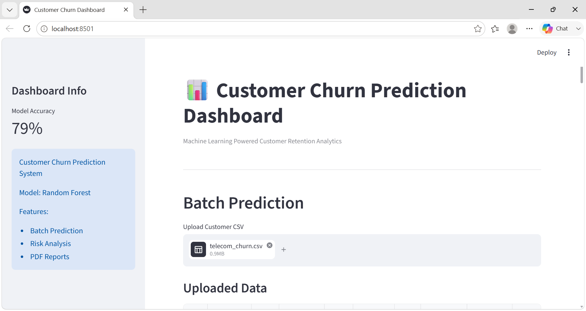
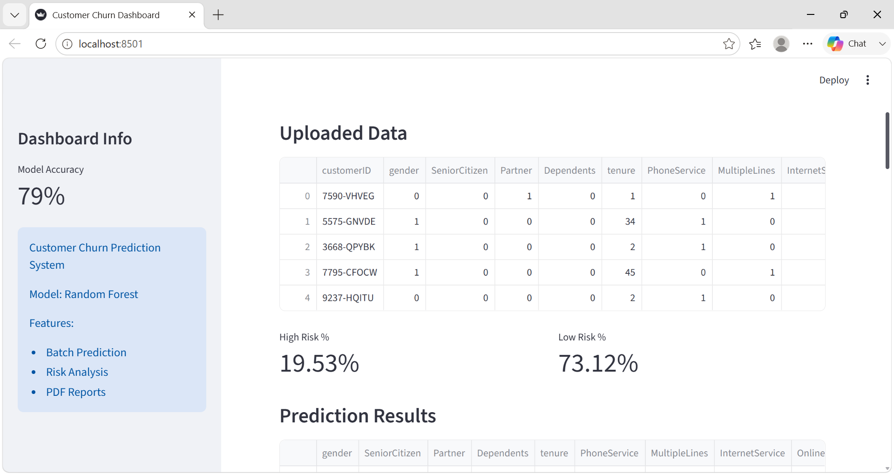
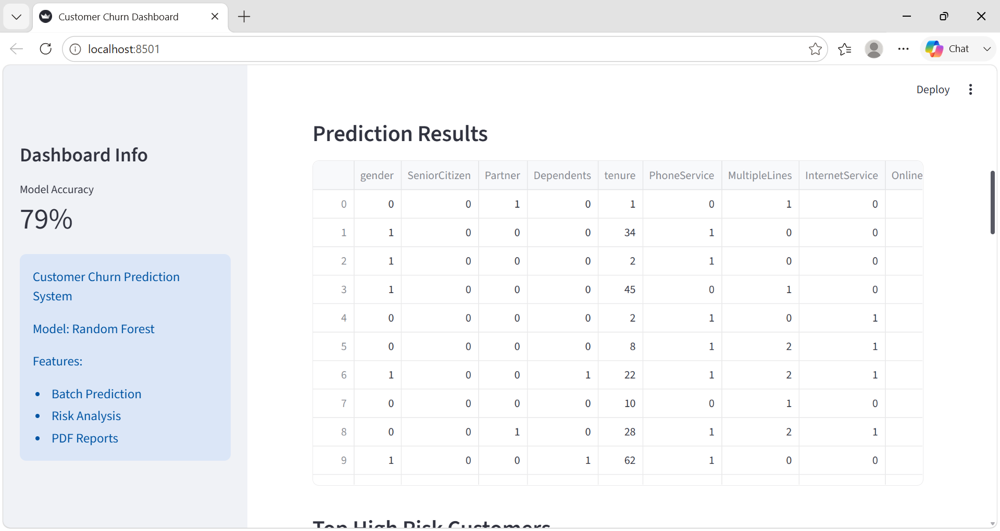
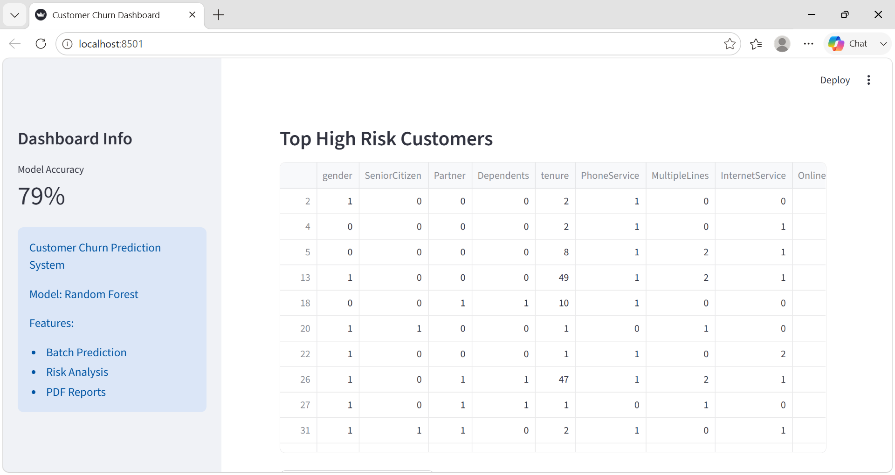
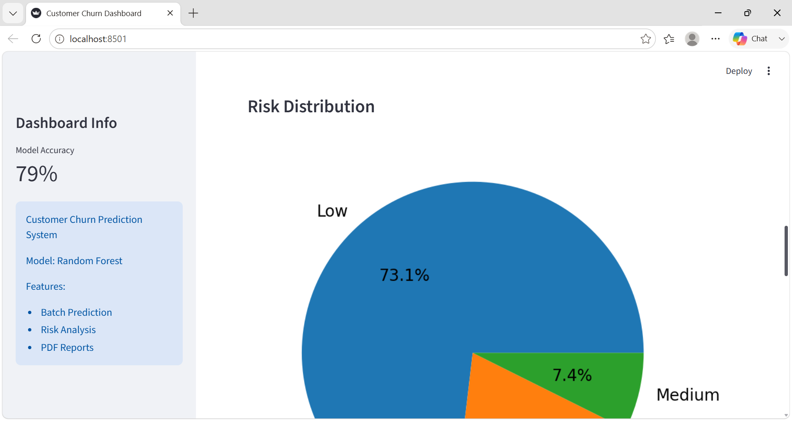
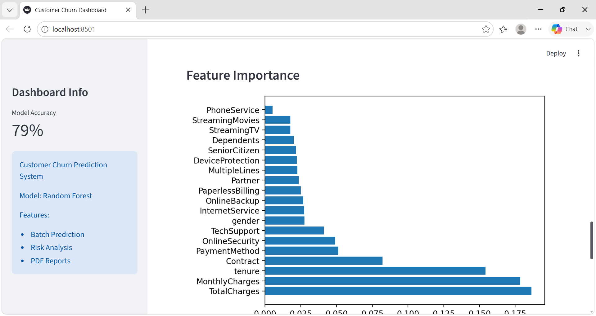
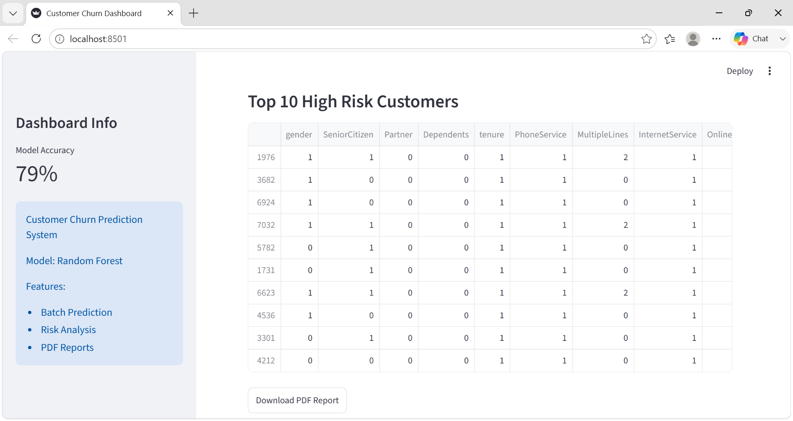

# Customer Churn Prediction Dashboard

Machine Learning project for predicting customer churn.

## Features

- Customer Churn Prediction
- Batch CSV Prediction
- Risk Classification
- Feature Importance Analysis
- Top High Risk Customers
- PDF Report Download
- Interactive Dashboard

## Tech Stack

- Python
- Streamlit
- Pandas
- Scikit-Learn
- Plotly
- Matplotlib

## Screenshots

### Dashboard

### Uploaded data

### Prediction Results

### Top High Risk Customers

### Risk Distrubtion

### Feature Importance

### Top 10 High Risk Customers

## Run Locally

'''bash
pip install -r requirements.txt
streamlit run app.py
